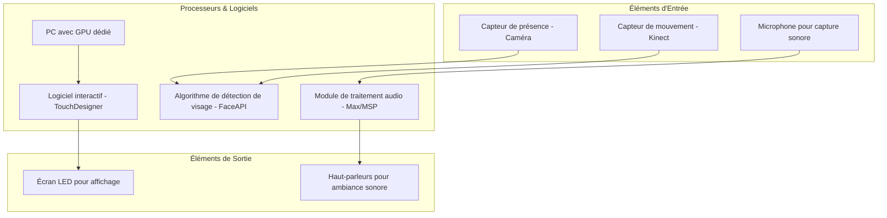

# Doppelgänger

## Synoptique

- **Éléments d'Entrée**: Captures user interaction and environmental input (presence, motion, and sound).
- **Processeurs & Logiciels**: Processes input data with TouchDesigner, FaceAPI for facial detection, and Max/MSP for audio.
- **Éléments de Sortie**: Outputs display visuals on LED screens and plays sound, enhancing the immersive ambiance of the installation.

## Plantation

## Simulation

## Scénarimage

## Devis Technique
