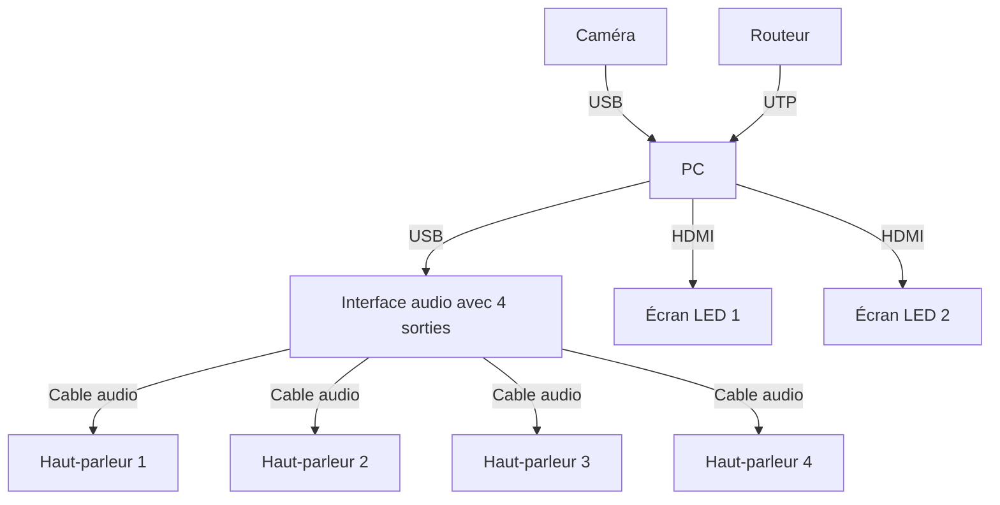

"Doppelgänger" est une installation interactive qui a la forme d'un miroir qui déforme le reflet de l'utilisateur, projettant des distortions sonores et visuelles, symbolisant l’exploitation de la vie privée par des groupes qui cherchent à abuser nos données personnelles.

# Devis Technique

## Fournis par l'artiste

- PC Windows
- Camera webcam 1080p

## Fournis par le diffuseur

### Vidéo

- Écran ~40"
- Écran ~20"
- 2 Cables HDMI

### Audio

- Interface audio avec 4 sorties
- 4 haut-parleurs aux alentours de l'utilisateur
- 4 cables XLR

# Synoptique

# Plantation

# Simulation

# Scénarimage

