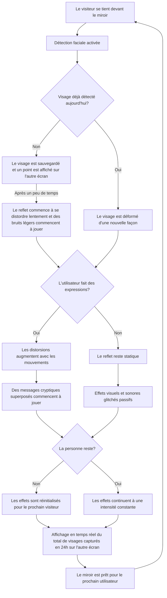
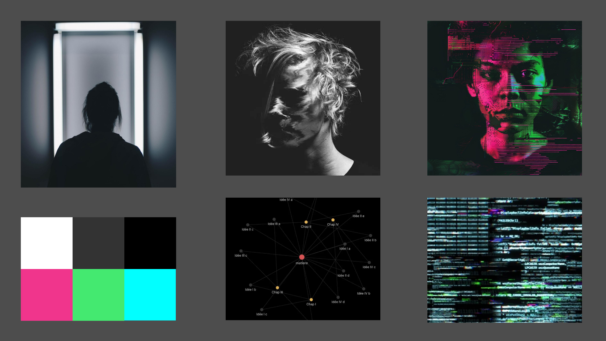
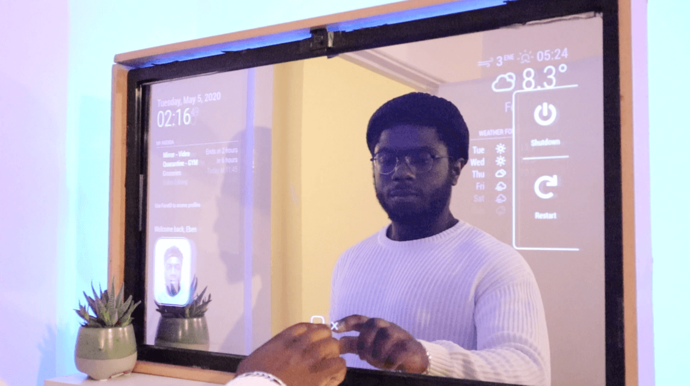

# Doppelgänger

## Idée
 **"Doppelgänger"** est une installation interactive qui a la forme d'un miroir qui déforme le reflet de l'utilisateur, projettant des distortions sonores et visuelles, **symbolisant l’exploitation de la vie privée** par des groupes qui cherchent à abuser nos données personnelles.
  
  
 ### Le sujet en plus de détails
 Une caméra placée hors de vue capture le visage de l'utilisateur pour lui appliquer des filtres; son reflet sera déformé pour simuler les conséquences de l'utilisation non consentie de ses informations personnelles. Des indices visuels et sonores apparaissent, suggérant que les traits de l’utilisateur sont analysés. Pour chaque visage unique détecté dans un cycle de 24 heures, un point apparaîtra sur un diagramme affiché sur un autre écran, illustrant le nombre de personnes capturées.
  
  
 
  
 face-api en action
  
  
 **Le but de l'installation est d'inviter les utilisateurs à une réflexion sur la collecte des données personnelles auxquelles on ne voudrait pas divulguer**, en provoquant un sentiment d'inconfort qui poussera le monde à rester vigilant ainsi que de lutter contre les organismes qui abusent de notre droit à la vie privée.

## Scénario

## Ambiance

Les visuels sombres et électroniques de cette installation créent une ambiance mystérieuse et captivante, inspirée par des mondes dystopiques fictifs comme "**Blade Runner**" et "**1984**".

### Rôle de la Planche d'Ambiances
Les images affichant un visage illustrent les effets de glitch potentiels sur l'utilisateur. L'image du miroir représente le sujet central de l'œuvre : le miroir lui-même. Des transitions ou des pop-ups de lignes de code peuvent apparaître pour simuler les actions réalisées en arrière-plan par le miroir.

### Palette de couleurs
Les tons neutres de la palette de couleurs renforcent la nature sérieuse du thème, tandis que les couleurs vives sont utilisées pour capturer l'attention et créer un contraste de couleur qui ressort les effets visuels. Le mélange de ces couleurs nous donne une palette dystopique qui ressort le thème de l'expérience.

### Audio

Pour la partie sonore du projet, des bruits urbains distordus et des effets sonores électroniques sont utilisés pour évoquer une ambiance troublante afin de susciter une réaction d'inconfort dans l'utilisateur.

[Exemple d'ambiance 1](https://www.youtube.com/watch?v=dIyfNWt7qSE)
 
[Exemple d'ambiance 2](https://www.youtube.com/watch?v=iym0s9Pa2LE)

## Technologies

### Matériaux Utilisés

- Un PC avec GPU dédié
- Une caméra
- 4 hauts-parleurs
- 2 écrans LED

 

Les matériaux utilisés nous permettront de créer un miroir similaire au [MagicMirror](https://magicmirror.builders/)
 

| **Logiciel**                    | **Utilisation**                                                            |
|---------------------------------|----------------------------------------------------------------------------|
| face-api.js                     | Reconnaissance faciale en temps réel                                       |
| Max                             | Conception sonore et manipulation audio en temps réel                      |
| TouchDesigner                   | Effets visuels et distorsions en temps réel                |
| OSC                             | Transfert de données en temps réel entre face-api.js, Max et TouchDesigner |
| Arduino                         | Contrôle des capteurs                                                      |
